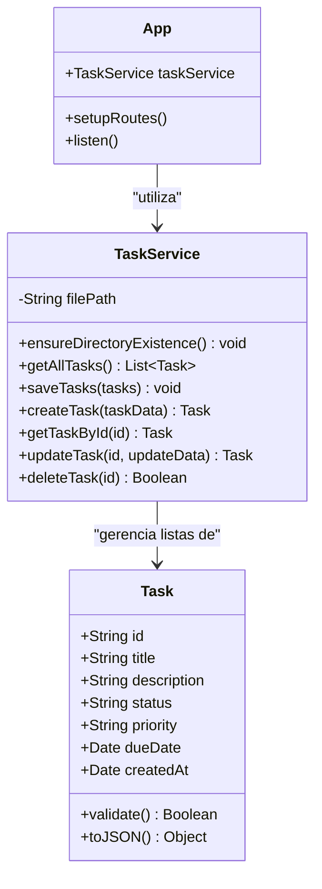

# Relatório Técnico: Engenharia de Software e Metodologias Ágeis

**Projeto**: Sistema de Gerenciamento de Tarefas Ágeis (TechFlow Tasks)  
**Cliente**: Startup de Logística  
**Desenvolvedor/Gestor**: [Seu Nome]  
**Empresa**: TechFlow Solutions  

---

## 1. Descrição do Projeto e Escopo Inicial

O projeto **TechFlow Tasks** consiste no desenvolvimento de um sistema web de gerenciamento de tarefas sob medida para uma startup de logística. No setor de logística, o controle preciso e em tempo real dos status de envios, carregamentos, roteirizações e despachos é crítico para garantir a eficiência operacional e o cumprimento de prazos.

### Escopo Inicial:
* **Frontend SPA (Single Page Application)**: Uma interface limpa, intuitiva, com design responsivo e de alto padrão (tema escuro e visual moderno), que evite distrações e permita o controle do fluxo.
* **Painel Kanban**: Organização visual das tarefas em três estados principais:
  1. `A Fazer` (To Do) - Atividades planejadas aguardando execução (ex: agendar manutenção da frota, planejar rotas de entrega).
  2. `Em Progresso` (In Progress) - Atividades ativas no momento (ex: caminhão #5 em carregamento, emissão de Notas Fiscais).
  3. `Concluído` (Done) - Tarefas finalizadas com sucesso (ex: entrega da carga #12 finalizada).
* **API de Gerenciamento**: Operações CRUD básicas integradas com persistência local em arquivo estruturado (`tasks.json`).
* **Qualidade de Software**: Execução de testes unitários locais e integração contínua para evitar regressões.

---

## 2. Metodologia Ágil Adotada: Scrumban

Para este projeto, foi escolhida a abordagem híbrida **Scrumban**, que une o melhor de duas grandes metodologias ágeis: o **Scrum** e o **Kanban**.

### Raciocínio de Escolha:
1. **Flexibilidade do Kanban**: O ambiente logístico é altamente dinâmico e imprevisível. Novas demandas de transporte críticas surgem a todo momento. O Kanban permite a incorporação dessas tarefas de forma imediata no topo do backlog e sua movimentação fluida.
2. **Ritmo do Scrum**: Os rituais de planejamento semanais (Sprints de 1 semana) ajudam a equipe a alinhar prioridades comerciais e avaliar a capacidade técnica.
3. **Limite de WIP (Work In Progress)**: O limite de tarefas paralelas em execução impede que os desenvolvedores fiquem sobrecarregados e ajuda a identificar gargalos (por exemplo, se muitas tarefas estiverem paradas em "Em Progresso" devido à lentidão na liberação de fretes, o painel denuncia visualmente).

---

## 3. Importância da Modelagem na Engenharia de Software

A modelagem de sistemas de software é uma etapa fundamental que antecede ou acompanha a programação. Suas principais vantagens são:
* **Comunicação Eficiente**: Reduz o ruído de comunicação entre stakeholders técnicos (desenvolvedores, arquitetos) e não técnicos (clientes de logística, gerentes de produto) usando notações padronizadas como a UML (Unified Modeling Language).
* **Redução de Custos**: Descobrir falhas arquiteturais ou de requisitos na fase de modelagem é centenas de vezes mais barato do que corrigi-las após o código estar pronto.
* **Guia de Implementação**: Diagramas claros de classes e de casos de uso servem como mapa detalhado para os desenvolvedores programarem com menos ambiguidades.

---

## 4. Diagramas UML

### A. Diagrama de Casos de Uso
O diagrama a seguir representa as interações dos atores (usuários) com os limites do sistema TechFlow Tasks.

```mermaid
usecaseDiagram
    actor "Gestor de Frota" as Gestor
    actor "Operador de Pátio" as Operador
    actor "GitHub Actions (CI)" as CI

    rect "Sistema TechFlow Tasks" {
        Gestor --> (Criar Nova Tarefa Logística)
        Gestor --> (Visualizar Quadro Kanban)
        Gestor --> (Excluir Tarefas)
        
        Operador --> (Visualizar Quadro Kanban)
        Operador --> (Mover Status da Tarefa)
        
        (Mover Status da Tarefa) ..> (Rodar Testes de Validação) : <<include>>
        (Rodar Testes de Validação) --> CI
    }
```

* **Atores**:
  * **Gestor de Frota**: Responsável por planejar e delegar as atividades e controlar prioridades e datas de vencimento.
  * **Operador de Pátio**: Atualiza o andamento das tarefas físicas em tempo real de acordo com as etapas logísticas.
  * **GitHub Actions**: Automatiza a checagem das modificações na base de código garantindo a estabilidade.

### B. Diagrama de Classes
O diagrama a seguir demonstra a estrutura estática do software, mapeando os atributos e métodos de suas classes constituintes.



* **Task**: Entidade pura que representa o registro da tarefa logística. Possui validações rígidas de consistência interna.
* **TaskService**: Camada de persistência e lógica de CRUD responsável por ler/escrever arquivos no disco simulando o banco de dados.

---

## 5. Justificativa da Mudança de Escopo (Simulação)

No decorrer da primeira Sprint, após reuniões de feedback com o cliente (a startup de logística), identificou-se uma lacuna no escopo inicial. As tarefas apenas podiam ser movidas entre as colunas do Kanban, mas não havia diferenciação de **urgência** nem **data limite de entrega** para despachos críticos.

### Justificativa de Engenharia:
* **Problema**: Sem classificação de prioridade ou data limite, o operador no pátio não conseguia diferenciar um carregamento comum de um produto perecível prestes a expirar o prazo regulamentar.
* **Solução Adotada (Mudança de Escopo)**: Alteração no design do sistema para acomodar o atributo `priority` (prioridades: Baixa, Média, Alta) e `dueDate` (prazo limite). O impacto estendeu-se ao backend (validação dos campos no modelo e service), frontend (exibição das tags coloridas de prioridade e prazo) e testes automatizados (novas asserções de erro).

---

## 6. Explicação sobre os Testes Automatizados

Para garantir que a mudança de escopo (ou qualquer alteração de código futura) não quebrasse o comportamento que já funcionava anteriormente, foram aplicados **Testes Unitários com Jest**:
1. **Testes do Modelo (Task Model)**: Validam se a criação das tarefas está de acordo com as regras de integridade (por exemplo, se falha caso o título seja em branco, ou se lança erro caso o status esteja fora da lista permitida).
2. **Testes do Serviço (TaskService)**: Validam as regras do CRUD simulado em arquivos locais (garante que tarefas sejam criadas, atualizadas e excluídas corretamente do disco).

Esses testes rodam automaticamente tanto localmente pelo desenvolvedor (`npm test`) quanto de forma transparente em ambiente de nuvem do GitHub Actions a cada nova contribuição de código.

---

## 7. Instruções para Captura de Telas (Prints) do GitHub

*Este guia orienta quais imagens capturar e comentar no documento de entrega oficial (PDF/DOCX):*

1. **Print do Quadro Kanban (Aba "Projects" do GitHub)**:
   * *O que capturar*: A visualização do seu GitHub Projects contendo as colunas "To Do", "In Progress" e "Done" preenchidas com pelo menos 10 cards.
   * *O que comentar*: Indicar como os cards representam as demandas do projeto e como a alteração de escopo foi adicionada como um novo card em "In Progress".
2. **Print dos Commits (Histórico do Git no GitHub)**:
   * *O que capturar*: A lista de commits do repositório no GitHub (tela em `https://github.com/usuario/repositorio/commits`). Deve exibir pelo menos 10 commits semânticos.
   * *O que comentar*: Explicar que a nomenclatura semântica (`feat:`, `docs:`, `test:`, `chore:`) facilita a rastreabilidade das alterações e agiliza revisões de código.
3. **Print do Workflow de CI Funcionando (GitHub Actions)**:
   * *O que capturar*: A aba "Actions" mostrando a execução com sucesso (sinal verde) do workflow de CI que compilou, rodou o linter e executou os testes com sucesso.
   * *O que comentar*: Ressaltar que a aprovação verde no pipeline garante que o código está seguro e pronto para ser implantado sem comprometer as funcionalidades existentes.
